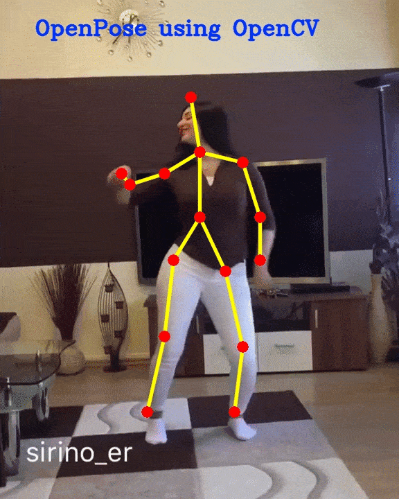
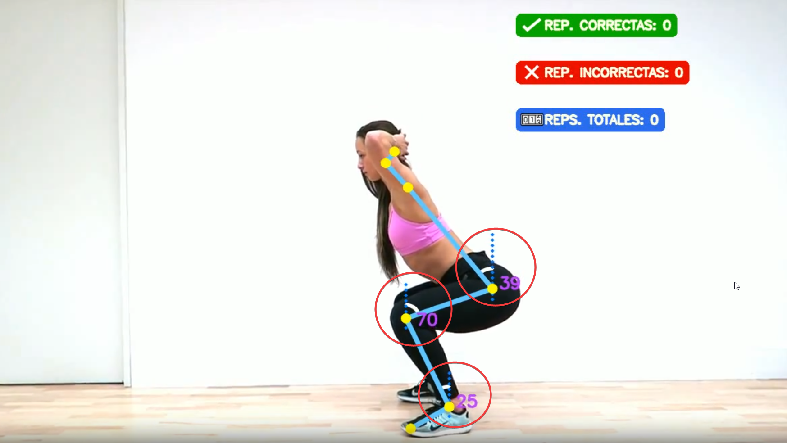
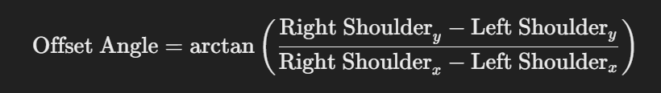
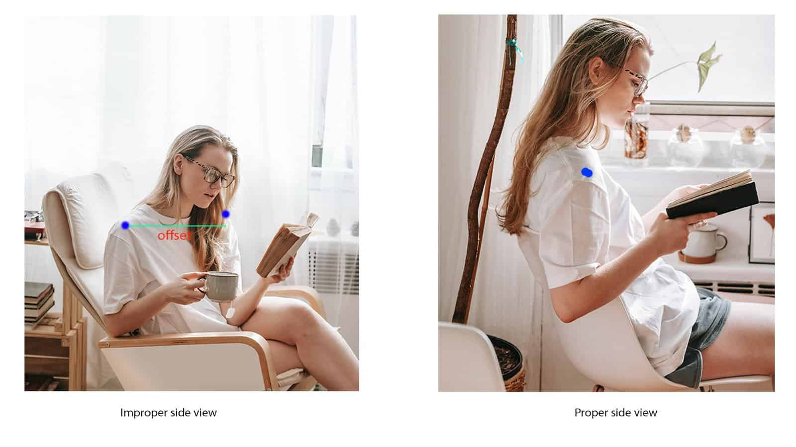
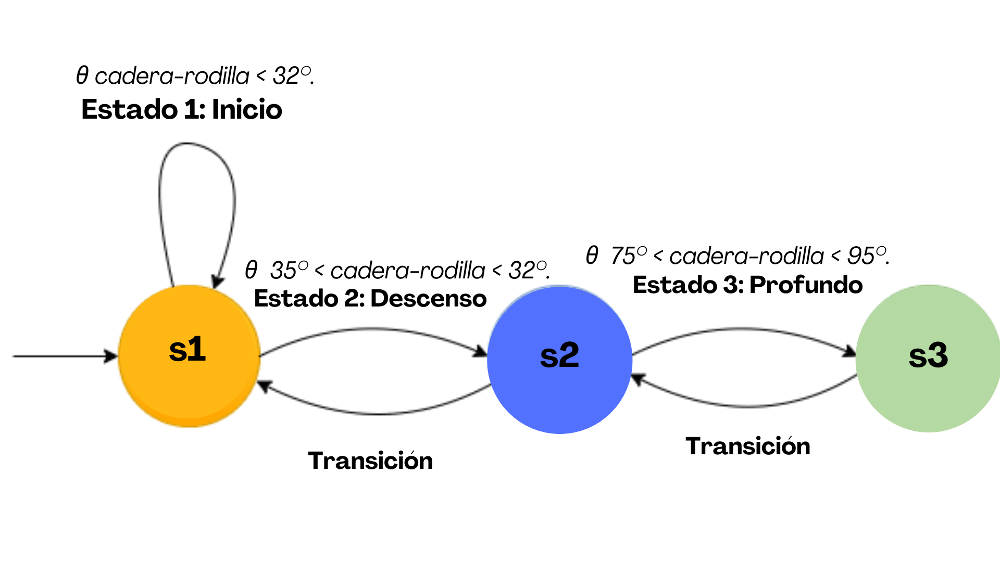

# IronAssist

Este proyecto utiliza MediaPipe Pose para estimar puntos clave del cuerpo y analizar la postura durante sentadillas.

## Funcionamiento del Algoritmo
1. **Detección y Seguimiento**: MediaPipe Pose detecta la región de interés (ROI) y predice puntos clave en 3D.
2. **Cálculo de Ángulos**: Se calculan ángulos entre hombro-cadera, cadera-rodilla y rodilla-tobillo.
   - **Ángulo hombro-cadera**: Determina la inclinación del torso.
   - **Ángulo cadera-rodilla**: Determina la profundidad de la sentadilla.
   - **Ángulo rodilla-tobillo**: Ayuda a verificar la postura de las piernas.

## Vista Lateral y Ángulo de Desfase
- **Detección Precisa**: La vista lateral asegura la correcta alineación de la columna y la postura de las rodillas.
- **Ángulo de Desfase (Offset Angle)**: Utilizado para verificar si el cuerpo está de lado o de frente. Si el ángulo hombro-cadera y cadera-rodilla están alineados lateralmente, se asume vista lateral.
- **Detección de Frente**: Si el offset angle no está alineado lateralmente, se detecta como vista de frente, ajustando la corrección de postura en consecuencia.

- **Evaluación**:
  - Si el ángulo es cercano a 0°, los hombros están alineados horizontalmente (vista frontal).
  - Si el ángulo es significativamente mayor que 0°, indica una alineación vertical (vista lateral).

## Rangos y Estados
- **Estado 1 (Inicio)**: Ángulo cadera-rodilla < 32°. 
 _Es básicamente el estado donde se actualizan los contadores de sentadillas correctas e incorrectas_.

- **Estado 2 (Descenso)**: 35° < Ángulo cadera-rodilla < 65°.
- **Estado 3 (Profundo)**: 75° < Ángulo cadera-rodilla < 95°.
  

## Feedback en Tiempo Real
El sistema proporciona feedback basado en los ángulos y estados:
- **Inclinación**: "Inclínate hacia adelante" o "hacia atrás" según el ángulo hombro-cadera.
- **Profundidad de Sentadilla**: Correcciones si las rodillas sobrepasan los pies o si la sentadilla es muy profunda.

## Modos de Dificultad: Principiante y Pro
La aplicación puede operarse en dos modos: Principiante y Pro. 

Como los nombres sugieren, el modo Pro tiene rangos más **estrictos** que el modo Principiante.

#### Aplicación de los umbrales en modo Pro
En el modo Pro, los umbrales son configurados para ofrecer un desafío mayor. Por ejemplo, los **ángulos de la cadera y la rodilla** tienen configuraciones específicas para diferentes estados:

- **Normal**: 
El ángulo debe estar entre 0 y 32 grados.
- **Descenso**: 
Debe oscilar entre 35 y 65 grados.
- **Profundo | Paso completo**: 
Entre 80 y 95 grados.

## Flujo de Trabajo
1. Procesa cada cuadro del video.
2. Detecta puntos clave del cuerpo.
3. Calcula ángulos y determina el estado actual.
4. Proporciona feedback basado en los cálculos.

